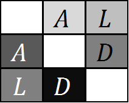

#### Please cite the paper below for the ALD measure.

[Thomson G, Single RM.](http://www.genetics.org/content/198/1/321) Conditional Asymmetric Linkage Disequilibrium (ALD): Extending the Bi-Allelic r^2 Measure. Genetics. 2014  198(1):321-331.

**Abstract**

For multiallelic loci, standard measures of linkage disequilibrium provide an incomplete description of the correlation of variation at two loci, especially when there are _different numbers of alleles_ at the two loci. We have developed a complementary pair of _conditional asymmetric_ linkage disequilibrium (ALD) measures. Since these measures do not assume symmetry, they more accurately describe the correlation between two loci and can identify heterogeneity in genetic variation not captured by other symmetric measures. For biallelic loci the ALD are symmetric and equivalent to the correlation coefficient r. The ALD measures are particularly relevant for disease-association studies to identify cases in which an analysis can be stratified by one of more loci. A stratified analysis can aid in detecting primary disease-predisposing genes and additional disease genes in a genetic region. The ALD measures are also informative for detecting selection acting independently on loci in high linkage disequilibrium or on specific amino acids within genes. For SNP data, the ALD statistics provide a measure of linkage disequilibrium on the same scale for comparisons among SNPs, among SNPs and more polymorphic loci, among haplotype blocks of SNPs, and for fine mapping of disease genes. The ALD measures, combined with haplotype-specific homozygosity, will be increasingly useful as next-generation sequencing methods identify additional allelic variation throughout the genome.

